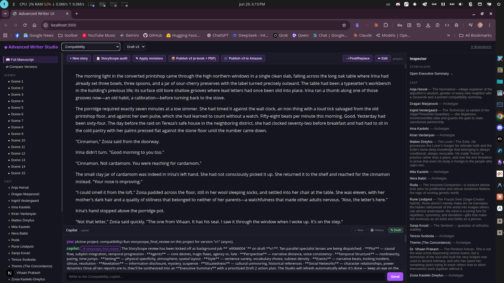

# Advanced Writer

> A modular narrative engineering system that uses neurochemical pacing, Jungian depth psychology, structural paradigm selection, and automated pathology diagnostics to produce fiction that resists the default failure modes of AI-generated prose.

---

## Technical Stack & Architecture

| Layer              | Component                                                                                                | Description                                                                                        |
| :----------------- | :------------------------------------------------------------------------------------------------------- | :------------------------------------------------------------------------------------------------- |
| **System Prompts** | [skill/SKILL.md](file:///home/ty/Repositories/ai_workspace/advanced-writer/skill/SKILL.md)               | Anthropic Skill 2.0 router pattern — 8 craft references, 5 workflows, 3 output templates           |
| **MCP Server**     | [src/server.ts](file:///home/ty/Repositories/ai_workspace/advanced-writer/src/server.ts)                 | TypeScript MCP server exposing narrative engineering workflows as tools                            |
| **Web UI**         | [app/studio/page.tsx](file:///home/ty/Repositories/ai_workspace/advanced-writer/app/studio/page.tsx)     | Next.js "Studio" IDE chat interface for real-time writing, side-by-side editing, and tool tracking |
| **Vector DB**      | [src/storage/chroma.ts](file:///home/ty/Repositories/ai_workspace/advanced-writer/src/storage/chroma.ts) | ChromaDB for persistent story arcs, world lore, and semantic context retrieval                     |
| **Graph DB**       | [src/storage/neo4j.ts](file:///home/ty/Repositories/ai_workspace/advanced-writer/src/storage/neo4j.ts)   | Neo4j Graph DB for character archetypes, faction systems, and relationship networks                |
| **AI Routing**     | [src/ai/router.ts](file:///home/ty/Repositories/ai_workspace/advanced-writer/src/ai/router.ts)           | Per-task routing layer supporting OpenRouter (cloud models) and Ollama (local models)              |
| **Configuration**  | [.env](file:///home/ty/Repositories/ai_workspace/advanced-writer/.env)                                   | Configuration file for API keys, database settings, and narrative parameters                       |

---

## The Writing Studio IDE



The primary interface of the system is the **Writing Studio IDE** (available at `http://localhost:3000`), which replaces the classic chatbot with a three-pane workspace tailored for professional fiction development:

1. **Narrative Explorer (Left Panel)**: A tree-view directory that displays active stories, available draft versions (e.g. `v1`, `v2`, `v3`), individual scenes, character sheets, structure briefs, and generated export assets.
2. **Manuscript Editor (Center Panel)**: A dominant editor showing the compiled story manuscript or the selected scene/document. Includes a visual **Diff comparison** tab that displays character-by-character insertions and deletions for draft revisions.
3. **Contextual Inspector (Right Panel)**: Dynamic inspector showing details related to the active selection:
   - **Story Settings**: Core story identity, logline, and target draft version.
   - **Scene Diagnostics**: Neurochemical transportation curves and pathology scorecards.
   - **Character Cards**: Pankseppian and Plutchikian profiling for selected characters.
4. **Copilot Rail (Bottom Panel)**: A persistent chat system that is always aware of the active project and automatically injects context using [read_story](file:///home/ty/Repositories/ai_workspace/advanced-writer/app/api/chat/route.ts) to prevent the AI from repeatedly asking the author to restate what their story is about.

### Asynchronous Background Jobs

Long-running generation tasks—such as creating a full novel blueprint, running a comprehensive manuscript review, or batch revising pathologies—execute as detached background tasks.

- When launched, these tools immediately return a unique job ID.
- The UI store ([app/store/workspaceStore.ts](file:///home/ty/Repositories/ai_workspace/advanced-writer/app/store/workspaceStore.ts)) automatically polls background job statuses.
- Upon job completion, the Zustand store updates the local workspace state, auto-refreshing the Narrative Explorer tree and Manuscript Editor view.

---

## Setup & Prerequisites

### 1. General Setup

1. **Install Node.js & NPM**: Ensure you have Node.js (v18+) installed.
2. **Build the Project**:
   ```bash
   npm install
   npm run build
   ```
3. **Configure Environment Variables**:
   Copy [.env.example](file:///home/ty/Repositories/ai_workspace/advanced-writer/.env.example) to `.env` and fill in your API keys (e.g. `OPENROUTER_API_KEY`) and database credentials:
   ```bash
   cp .env.example .env
   ```

---

### 2. ChromaDB Vector Setup

Chroma DB is used for semantic retrieval of story arcs, lore, and character memories.

#### **Zero-Manual-Steps Auto-Starter**

The system features a node-native auto-starting server layer ([src/storage/chroma-server.ts](file:///home/ty/Repositories/ai_workspace/advanced-writer/src/storage/chroma-server.ts)).

- You do **not** need to install Python Chroma packages or manually run `chroma run` in a separate terminal.
- When the MCP server or Web UI first initializes, it checks if a Chroma server is running on the configured host and port.
- If not, it automatically spawns the Chroma CLI directly from the bundled npm package (`node_modules/chromadb/dist/cli.mjs run`).
- Data is saved persistently in the folder configured by `CHROMA_PERSIST_DIR` (defaults to `./data/chroma`).

#### **Embedding Model Setup (Ollama)**

ChromaDB utilizes Ollama to compute embeddings locally via the official `@chroma-core/ollama` wrapper.

1. **Install Ollama**: Follow instructions at [ollama.com](https://ollama.com) to run the Ollama daemon.
2. **Pull the Default Embedding Model**:
   Run the following command to download the default embedding model, `nomic-embed-text`:
   ```bash
   ollama pull nomic-embed-text
   ```
3. **(Optional) Customize Config in `.env`**:
   Adjust the defaults if needed:
   ```env
   OLLAMA_BASE_URL=http://localhost:11434
   OLLAMA_EMBEDDING_MODEL=nomic-embed-text:latest
   CHROMA_HOST=localhost
   CHROMA_PORT=8001
   CHROMA_PERSIST_DIR=./data/chroma
   ```

---

### 3. Neo4j Graph Setup

Neo4j is utilized to map complex character networks, archetypal structures, and lore facts.

1. **Install Neo4j**: Download and install **Neo4j Desktop** (free Community Edition) or run via Docker.
2. **Install Graph Data Science Library**: Open your database settings in Neo4j Desktop and ensure the **GDS (Graph Data Science)** plugin is installed and activated.
3. **Database Configuration**:
   Create a database and update your [.env](file:///home/ty/Repositories/ai_workspace/advanced-writer/.env) file with the credentials:
   ```env
   NEO4J_URI=bolt://localhost:7687
   NEO4J_USER=neo4j
   NEO4J_PASSWORD=your_password_here
   NEO4J_DATABASE=neo4j
   ```
4. **Verify Neo4j Connection**:
   You can run the test script to verify your Neo4j configuration is working:
   ```bash
   npx tsx test_workspace.ts
   ```

---

### 4. Running the System

1. **Run the MCP Server**:
   To start the MCP server directly via stdio:
   ```bash
   npm run start
   ```
2. **Add to MCP Client**:
   Reference [mcp_config.json.example](file:///home/ty/Repositories/ai_workspace/advanced-writer/mcp_config.json.example) to register the server in your MCP client (e.g. Claude Desktop, Cursor). Make sure the path points to your built [dist/index.js](file:///home/ty/Repositories/ai_workspace/advanced-writer/dist/index.js).
3. **Run the Web Studio UI**:
   ```bash
   npm run dev:ui
   ```
   Open `http://localhost:3000` in your web browser.

## MCP Tools Reference

The Model Context Protocol server exposes **17 specialized tools** to handle the narrative engineering lifecycle:

### Idea & Brainstorming

1. [brainstorm_ideas](file:///home/ty/Repositories/ai_workspace/advanced-writer/src/tools/brainstorm.ts)
   Generate a batch of genuinely good, distinct story concepts (logline + genre + tone + hook) for brainstorming — premises with a real emotional core and a fresh angle, the kind that could become a beloved or cult-classic novel, never gimmicks or absurdist mashups. Use when the user wants fresh story ideas, riffs on a seed, or 'more like that' — discussion only; this never starts writing a story.

### Narrative Architecture

2. [create_narrative](file:///home/ty/Repositories/ai_workspace/advanced-writer/src/tools/create-narrative.ts) (Async-capable)
   Build a complete narrative from a logline, premise, or raw idea. Runs an 8-step pipeline: intake -> hamartia -> framework -> characters -> architecture -> draft -> diagnostic.
3. [select_structure](file:///home/ty/Repositories/ai_workspace/advanced-writer/src/tools/select-structure.ts)
   Interactively select the right structural framework (Truby, Dramatica, Kishōtenketsu, Fichtean) for a story based on its Designing Principle.
4. [build_world_bible](file:///home/ty/Repositories/ai_workspace/advanced-writer/src/tools/build-world-bible.ts)
   Expands a premise into a highly detailed World Bible including Factions, Tech/Magic, Economics, and Geography, and saves it to Vector Memory.

### Character & Cast Setup

5. [develop_character](file:///home/ty/Repositories/ai_workspace/advanced-writer/src/tools/develop-character.ts)
   Create, update, query, list, or shadow-match characters in the persistent Archetypal Database.

### Drafting & Expansion

6. [expand_to_novel](file:///home/ty/Repositories/ai_workspace/advanced-writer/src/tools/expand-to-novel.ts) (Async-capable)
   Expands a synopsis into a structured ARC (beat-sheet scaffold seeded into the graph timeline + Chroma), runs a world-model self-consistency check, and optionally auto-drafts the whole manuscript beat by beat with the per-scene continuity gate.
7. [continue_narrative](file:///home/ty/Repositories/ai_workspace/advanced-writer/src/tools/continue-narrative.ts) (Async-capable)
   Continue drafting a story by generating the next scene based on the previous scene, the story architecture, and user direction.

### Diagnosis & Editing

8. [review_narrative](file:///home/ty/Repositories/ai_workspace/advanced-writer/src/tools/review-narrative.ts)
   Run neurochemical scoring, pathology diagnostics, and agency enforcement on existing text. Produces a structured neuro-critique report.
9. [rewrite_scene](file:///home/ty/Repositories/ai_workspace/advanced-writer/src/tools/rewrite-scene.ts)
   Targeted scene rewriting with before/after neurochemical scoring. Identifies specific pathologies and produces an improved version.
10. [batch_revise_pathologies](file:///home/ty/Repositories/ai_workspace/advanced-writer/src/tools/batch-revise-pathologies.ts) (Async-capable)
    Scans a story's diagnostics, triggers a Character Writer's Room debate for failing scenes, and automatically rewrites them based on the characters' feedback.
11. [find_replace](file:///home/ty/Repositories/ai_workspace/advanced-writer/src/tools/find-replace.ts)
    Deterministic find & replace across a story's documents — the literal counterpart to the AI rewrite tools. Renames a term everywhere, fixes a recurring typo, or changes a single word/line, touching ONLY the matched text. Defaults to a safe PREVIEW (apply=false) that reports every match without changing files; set apply=true to write the edits (each touched file is backed up first). Supports literal, whole-word, and regex matching.

### Post-Draft Analysis & Second Draft Pass

12. [storyscope_final_review](file:///home/ty/Repositories/ai_workspace/advanced-writer/src/tools/storyscope-review.ts) (Async-capable)
    Runs the ultimate multi-agent StoryScope review on a finished manuscript. Dispatches 7 parallel analytical lenses (Plot, Agents, Style, etc.) and synthesizes them into an Executive Summary.
13. [apply_storyscope_revisions](file:///home/ty/Repositories/ai_workspace/advanced-writer/src/tools/apply-storyscope-revisions.ts) (Async-capable)
    Builds the next draft version from the StoryScope review. Non-destructive and auto-incrementing (v1->v2->v3...). The planner assigns each critique issue to EXACTLY ONE operation: 'rewrite' (full-scene revision), 'line_edit' (surgical anchored edits that preserve polished prose), 'cut_scene', 'merge_scenes', or 'add_scene' — so structural fixes the review asks for are actually executable. Every change is (a) checked against the World Bible's hard rules, (b) VERIFIED against its own directive (PASS/FAIL with cited evidence, retried with auditor feedback on FAIL), (c) re-scored on the neurochemical diagnostic, and (d) logged with deterministic diff stats. Ends with a COVERAGE REPORT mapping every critique item -> op -> scene -> verified status (including items it could NOT action, honestly), and updates the persistent cross-version issue ledger. Pass 'directives' to apply a human-approved/edited plan instead of the auto-generated one. This tool only revises PROSE — for canon reconciliation use reconcile_storyscope_canon.
14. [reconcile_storyscope_canon](file:///home/ty/Repositories/ai_workspace/advanced-writer/src/tools/reconcile-storyscope-canon.ts) (Async-capable)
    Applies the StoryScope review's CANON RECONCILIATION findings: updates the World Bible, Architecture Brief, and character graph metadata so the planning documents catch up to the manuscript's improvements. Complements apply_storyscope_revisions, which only rewrites prose and deliberately ignores canon divergence — this tool is the other half of the review's to-do list and never touches scene text. Non-destructive: the previous World Bible / Architecture Brief are backed up before being overwritten, and every run appends to a persistent changelog.

### Publishing & Export

15. [publish_story](file:///home/ty/Repositories/ai_workspace/advanced-writer/src/tools/publish-story.ts)
    Package a finished story for publishing. target='amazon' (default) produces the full Amazon/KDP kit: e-book, cover image, print-ready paperback PDF, a listing sheet (description, keywords, categories), and a plain-language upload walkthrough. target='share' produces just a clean e-book + reading PDF. Non-destructive: writes to the project's publish/ folder. Use when the user wants to publish, sell, export, or ship their finished book.

### Background Job Management

16. [check_job](file:///home/ty/Repositories/ai_workspace/advanced-writer/src/tools/index.ts)
    Check the status/result of a background job started by running a long tool with async=true. Returns running | completed | failed plus the final summary.
17. [list_jobs](file:///home/ty/Repositories/ai_workspace/advanced-writer/src/tools/index.ts)
    List recent background jobs (most recent first) with their status.

---

## Interaction & Copilot Modes

During narrative drafting and brainstorming, you can switch between three interaction modes:

- **Brainstorm Q&A (Default)**: The Copilot conducts interactive interviews, asking clarifying questions and planning structural directions before writing.
- **Collaborative**: The Copilot drafts scene-by-scene, stopping to request author feedback, reviews, and edits before moving forward.
- **Fast-Auto**: The Copilot writes autonomously, generating the manuscript from the available story architecture and beats without blocking for input.

---

## File Structure

```
advanced-writer/
├── README.md                         # Project documentation
├── LICENSE                           # GPLv3 License file
├── package.json                      # Node project configuration
├── package-lock.json                 # Lockfile for dependencies
├── tsconfig.json                     # TypeScript configuration (Next.js app/src)
├── tsconfig.mcp.json                 # TypeScript configuration (MCP server build)
├── next.config.js                    # Next.js configuration (Webpack resolution)
├── test_workspace.ts                 # Test script for Neo4j connection
├── mcp_config.json.example           # Example configuration for MCP client
├── app/                              # Next.js Web UI
│   ├── page.tsx                      # Primary page router (defaults to Studio)
│   ├── layout.tsx                    # Root HTML layout
│   ├── globals.css                   # Global styles & layout variables
│   ├── classic/                      # Classic dashboard UI (deprecated)
│   │   └── page.tsx
│   ├── studio/                       # Writing Studio IDE
│   │   └── page.tsx                  # Three-pane Studio interface
│   ├── store/                        # Frontend state
│   │   └── workspaceStore.ts         # Zustand store for project polling & jobs
│   └── api/                          # Serverless routes for Web UI
│       ├── chat/route.ts             # Copilot endpoint (wraps MCP tools + read_story)
│       └── workspace/route.ts        # Workspace directory polling
├── skill/                            # Narrative engineering core directives & guidelines
│   ├── SKILL.md                      # Intake router & craft philosophy
│   ├── workflows/                    # Step-by-step procedures (intake, rewrite, etc.)
│   ├── references/                   # Core modules (Neurochemical, Jungian, Agency, etc.)
│   └── templates/                    # Output blueprints (character sheets, briefs)
├── src/                              # MCP Server Source Code
│   ├── index.ts                      # Server startup entry
│   ├── server.ts                     # MCP server setup & schema registration
│   ├── config.ts                     # Environment variable parsing and validation
│   ├── jobs.ts                       # Asynchronous background job system
│   ├── tools/                        # MCP Tool definitions & execution dispatchers
│   │   ├── index.ts                  # Tool registry & job execution routing
│   │   ├── brainstorm.ts             # Concept brainstorming engine
│   │   ├── publish-story.ts          # Packaging exporter tool
│   │   └── ...                       # Other MCP tool handlers
│   ├── publish/                      # Publishing formats & exporters
│   │   ├── amazon.ts                 # KDP listing metadata & guide compiler
│   │   ├── chapters.ts               # Chapter reader utility
│   │   ├── epub.ts                   # Zip packaging for EPUB 3
│   │   └── pdf.ts                    # Headless Puppeteer print PDF rendering
│   ├── storage/                      # Database persistence layer
│   │   ├── chroma-server.ts          # Zero-install node auto-starter for Chroma
│   │   ├── chroma.ts                 # Chroma client & Ollama embeddings setup
│   │   ├── neo4j.ts                  # Neo4j driver & Cypher transaction utilities
│   │   └── workspace.ts              # File-based manuscript folder manager
│   ├── ai/                           # AI provider layer
│   │   └── router.ts                 # Model capabilities router
│   └── types/                        # Shared type definitions
└── data/                             # Runtime data (gitignored)
    ├── chroma/                       # Local Chroma DB data
    └── workspace/                    # Stories directory (exports, manuscripts, drafts)
```

---

## License

[GPLv3](LICENSE)
