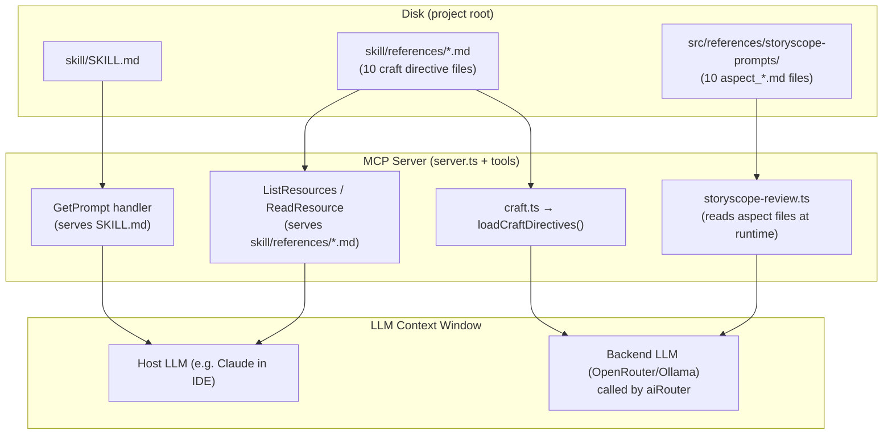
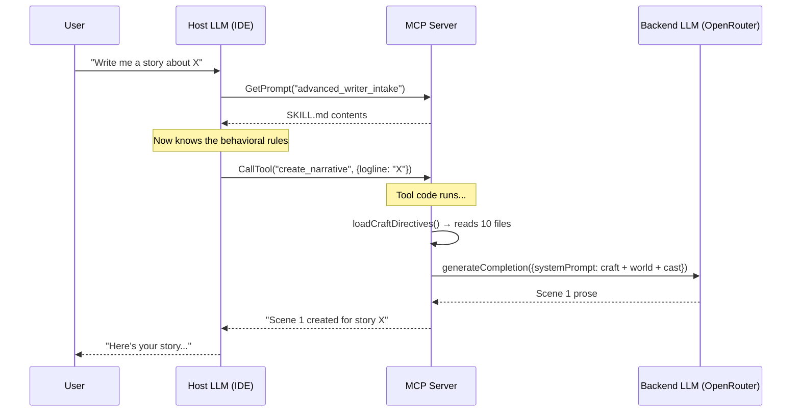

# How the Advanced Writer Agent Operates

This document traces exactly how the SKILL.md, craft references, and storyscope prompts flow through the system — from disk to the LLM's context window.

---

## The Big Picture

The advanced-writer is an **MCP (Model Context Protocol) server**. It doesn't "think" on its own — it exposes **tools**, **resources**, and **prompts** that a host LLM (like me, running in your IDE) can call. The skill files and storyscope prompts are injected into the LLM's context via **two completely different mechanisms**:



---

## Mechanism 1: SKILL.md → Host LLM (via MCP Prompts)

**What**: The [SKILL.md](file:///home/ty/Repositories/ai_workspace/advanced-writer/skill/SKILL.md) file is the agent's "personality" and behavioral instructions.

**How**: In [server.ts](file:///home/ty/Repositories/ai_workspace/advanced-writer/src/server.ts#L97-L132), the MCP server registers a **prompt** called `advanced_writer_intake`:

```typescript
server.setRequestHandler(GetPromptRequestSchema, async (request) => {
  if (request.params.name === "advanced_writer_intake") {
    const skillMd = await fs.readFile(
      path.join(SKILL_DIR, "SKILL.md"),
      "utf-8",
    );
    return {
      description: "Advanced Writer Intake Prompt",
      messages: [
        { role: "user", content: { type: "text", text: skillMd } },
      ],
    };
  }
});
```

**When the host LLM requests this prompt**, the entire SKILL.md (all 205 lines — the essential principles, mode system, workflow descriptions) is returned as a message. The host LLM then has those instructions in its context and follows them when orchestrating tool calls.

> [!NOTE]
> The SKILL.md is **not** automatically pushed to the host LLM. The LLM (or the IDE integration) must explicitly request the `advanced_writer_intake` prompt. It's a pull mechanism.

---

## Mechanism 2: Craft References → Backend LLM (via `loadCraftDirectives()`)

**What**: The 10 craft reference files in [skill/references/](file:///home/ty/Repositories/ai_workspace/advanced-writer/skill/references) are the "how to write well" instructions — neurochemical pacing, archetypal patterns, diagnostics, etc.

**How**: [craft.ts](file:///home/ty/Repositories/ai_workspace/advanced-writer/src/ai/craft.ts#L14-L52) defines a hardcoded list of filenames and loads them all at runtime:

```typescript
const CRAFT_FILES = [
  "00-master-core-directives.md",
  "01-neurochemical-engine.md",
  "02-structural-paradigms.md",
  // ... 7 more files
  "storyscope-anti-patterns.md",
];

export function loadCraftDirectives(): string {
  // Resolves to project_root/skill/references/
  const root = path.resolve(__dirname, "../../skill/references");
  const parts: string[] = [];
  for (const f of CRAFT_FILES) {
    parts.push(fs.readFileSync(path.join(root, f), "utf8").trim());
  }
  cached = parts.join("\n\n---\n\n").trim();
  return cached;
}
```

**Who calls it**: The writing tools — [create-narrative.ts](file:///home/ty/Repositories/ai_workspace/advanced-writer/src/tools/create-narrative.ts#L192) and [continue-narrative.ts](file:///home/ty/Repositories/ai_workspace/advanced-writer/src/tools/continue-narrative.ts#L170) — inject this blob directly into the **system prompt** sent to the backend LLM (OpenRouter or Ollama):

```typescript
const draftPrompt = `Write the opening scene...

=== CRAFT DIRECTIVES (apply these WHILE writing) ===
${loadCraftDirectives()}

=== WORLD CONTINUITY LEDGER ===
...`;
```

> [!IMPORTANT]
> These craft directives go to the **backend LLM** (via `aiRouter.generateCompletion()`), **not** to the host LLM running in your IDE. The host LLM never sees these files unless it reads them via the MCP resource handler (see below).

### Dual Exposure via MCP Resources

The same `skill/references/*.md` files are **also** exposed as MCP resources in [server.ts](file:///home/ty/Repositories/ai_workspace/advanced-writer/src/server.ts#L54-L95):

```typescript
server.setRequestHandler(ListResourcesRequestSchema, async () => {
  const files = await fs.readdir(REFERENCES_DIR);
  const mdFiles = files.filter((f) => f.endsWith(".md"));
  return {
    resources: mdFiles.map((file) => ({
      uri: `advanced-writer://reference/${file}`,
      name: file,
      mimeType: "text/markdown",
    })),
  };
});
```

This means the host LLM **can** read them on demand via `advanced-writer://reference/01-neurochemical-engine.md`, but in practice the main consumer is `loadCraftDirectives()` inside the tool code.

---

## Mechanism 3: Storyscope Prompts → Backend LLM (via `storyscope-review.ts`)

**What**: The 10 `aspect_*.md` files in [src/references/storyscope-prompts/](file:///home/ty/Repositories/ai_workspace/advanced-writer/src/references/storyscope-prompts) are analytical lenses (Plot, Agents, Style, Perspective, etc.) for reviewing a finished manuscript.

**How**: [storyscope-review.ts](file:///home/ty/Repositories/ai_workspace/advanced-writer/src/tools/storyscope-review.ts#L95-L160) discovers and reads them at runtime:

```typescript
const promptsDir = path.join(__dirname, "../references/storyscope-prompts");
const promptFiles = await fs.promises.readdir(promptsDir);
const aspectFiles = promptFiles.filter(
  (f) => f.startsWith("aspect_") && f.endsWith(".md"),
);

// Run parallel evaluations — one LLM call per aspect file
const promises = aspectFiles.map(async (file) => {
  const rawPrompt = await fs.promises.readFile(
    path.join(promptsDir, file), "utf8"
  );
  const modifiedPrompt = `${rawPrompt}\n\n=== OVERRIDE INSTRUCTIONS ===\n...`;

  const report = await aiRouter.generateCompletion({
    taskType: "diagnostic",
    systemPrompt: modifiedPrompt,
    userMessage: `... [manuscript + architecture + world bible + graph state] ...`,
  });
});
```

**The flow**:
1. The host LLM calls the `storyscope_final_review` tool with a `story_id`
2. The tool reads the manuscript from the workspace
3. It discovers all `aspect_*.md` files in the storyscope-prompts directory
4. For **each** aspect file, it makes a **separate** backend LLM call, using the aspect file as the system prompt and the manuscript as the user message
5. All 10 calls run in **parallel** (`Promise.allSettled`)
6. A final synthesis call merges the 10 reports into an Executive Summary

> [!NOTE]
> The storyscope prompts are **not** exposed as MCP resources or prompts. They are internal to the tool — the host LLM has no direct access to them.

---

## Summary: Where Each File Ends Up

| File(s) | Location on Disk | Delivery Mechanism | Recipient LLM | When |
|---|---|---|---|---|
| `SKILL.md` | `skill/SKILL.md` | MCP Prompt (`advanced_writer_intake`) | **Host LLM** (IDE) | On-demand when prompt is requested |
| Craft references (10 files) | `skill/references/*.md` | `loadCraftDirectives()` injected into system prompt | **Backend LLM** (OpenRouter/Ollama) | Every `create_narrative` and `continue_narrative` call |
| Craft references (same files) | `skill/references/*.md` | MCP Resources (`advanced-writer://reference/*`) | **Host LLM** (IDE) | On-demand if the host reads a resource |
| Storyscope aspect prompts (10 files) | `src/references/storyscope-prompts/aspect_*.md` | Direct `fs.readFile` inside `storyscope-review.ts` | **Backend LLM** (OpenRouter/Ollama) | During `storyscope_final_review` — 10 parallel calls |
| `NAMING_RULE` | Hardcoded in `craft.ts` | String constant in system/user prompts | **Backend LLM** | Every scene draft |

---

## The Two LLMs

This is the key architectural insight:

1. **Host LLM** (me, running in your IDE) — orchestrates which tools to call and in what order. Gets the SKILL.md behavioral instructions via the MCP prompt. Sees tool definitions and their return values.

2. **Backend LLM** (OpenRouter/Ollama, configured in `.env` via `MODEL_GENERATION` / `MODEL_DIAGNOSTIC`) — does the actual creative writing and analysis. Gets the craft directives and storyscope prompts injected directly into its system prompt by the tool code.


